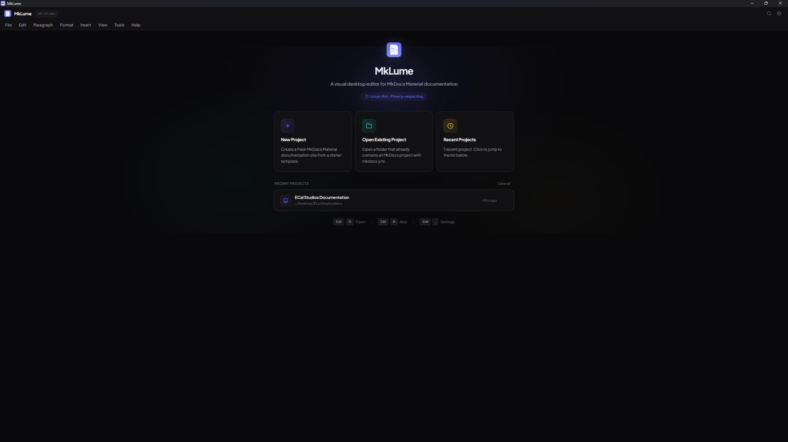

<p align="center">
  
</p>

<h1 align="center">MkLume</h1>

<p align="center">
  <strong>A visual desktop editor for MkDocs Material documentation.</strong>
</p>

<p align="center">
  <a href="https://www.ecalstudios.com/mklume/">Documentation</a> ·
  <a href="https://github.com/ecalstudios/mklume/issues">Issues</a> ·
  <a href="https://ko-fi.com/ecalstudios">Ko-fi</a> ·
  <a href="#license">License</a>
</p>

---



## What is MkLume?

MkLume is a local-first desktop app for creating, editing, previewing, and managing [MkDocs Material](https://squidfunk.github.io/mkdocs-material/) documentation projects.

It is made for people who like the power of MkDocs, but do not always want to jump between a code editor, terminal, file explorer, YAML files, Markdown files, and browser previews just to update documentation.

With MkLume, you can open an existing MkDocs project, create a new one, edit pages, manage navigation, preview the site, check for common problems, and build/export the final documentation from one focused desktop workspace.

MkLume edits your local files directly. It does not ask for cloud credentials, hosting tokens, GitHub tokens, passwords, or API keys.

Built with [Tauri](https://tauri.app/), [React](https://react.dev/), [TypeScript](https://www.typescriptlang.org/), and [Rust](https://www.rust-lang.org/).

> **Version:** 1.0.0  
> **Status:** MkLume is in active development. Installers and public releases will be added through GitHub Releases.

## Why I made it

MkDocs Material is excellent, but managing a documentation site can still feel a little too manual, especially when you are writing a lot of pages, adding images, fixing links, adjusting navigation, or preparing a site for release.

MkLume is my attempt to make that workflow easier without hiding the project from you. Your docs stay as normal Markdown files. Your configuration stays as `mkdocs.yml`. Your site is still a real MkDocs Material site. MkLume simply gives you a friendlier workspace around it.

The goal is not to replace MkDocs. The goal is to make working with MkDocs smoother, clearer, and less repetitive.

## Main features

### Editing and preview

- **Markdown editing** with useful toolbar actions, keyboard shortcuts, and insert helpers.
- **Visual editing** for common documentation blocks like headings, paragraphs, images, code blocks, lists, admonitions, and more.
- **Page preview** so you can quickly check how a page reads while you work.
- **Site preview** that approximates a MkDocs Material layout inside the app, including header, sidebar, content, table of contents, and footer.
- **Split view** combinations for Markdown, visual editing, page preview, and site preview.

### MkDocs project management

- **Open existing MkDocs projects** that already contain a `mkdocs.yml` file.
- **Create new projects** from a starter structure.
- **Visual site settings editor** for common `mkdocs.yml` options.
- **Navigation editor** for managing pages, groups, ordering, and missing entries.
- **Project health checks** for broken links, missing images, navigation issues, extension problems, and common content warnings.

### Images and links

- **Drag-and-drop image handling** that copies images into your documentation assets folder and inserts Markdown for you.
- **Smart internal linking** to help link between documentation pages faster.
- **Cleaner asset workflow** for documentation projects that use many screenshots, icons, and images.

### Build and release workflow

- **Local MkDocs preview server** from inside the app.
- **Build export** to a folder, ZIP file, or both.
- **Git sync helper** for simple commit and push workflows using your local Git setup.
- **GitHub Pages deploy assistant** that can generate a GitHub Actions workflow without storing tokens in MkLume.

### Reliability and comfort

- **Autosave options** for safer writing sessions.
- **Local backups** before saves.
- **Recovery drafts** for unsaved work.
- **Command palette** with quick access to app actions.
- **Light and dark mode** with system preference support.

## Who is it for?

MkLume is useful if you:

- Write documentation with MkDocs Material.
- Maintain a product, plugin, app, tool, or open-source project.
- Want a more visual workflow without giving up Markdown.
- Prefer local-first tools over cloud dashboards.
- Want to build and export documentation without remembering every terminal command.
- Are learning MkDocs and want a friendlier way to manage the project structure.

## Download

Installers are planned for GitHub Releases.

Until the first public release is available, MkLume can be built from source.

## Build from source

MkLume requires:

- [Node.js](https://nodejs.org/) v18 or newer
- [Rust](https://rustup.rs/)
- The [Tauri 2 prerequisites](https://v2.tauri.app/start/prerequisites/) for your operating system
- [Python](https://www.python.org/) if you want to use MkDocs build/serve features
- [MkDocs Material](https://squidfunk.github.io/mkdocs-material/) for local documentation builds

Clone the repository and run the app:

```bash
git clone https://github.com/ecalstudios/mklume.git
cd mklume
npm install
npx tauri dev
```

Build the desktop app:

```bash
npx tauri build
```

Install MkDocs Material for local site preview/build features:

```bash
pip install mkdocs mkdocs-material
```

## Documentation

Full documentation will live here:

**https://www.ecalstudios.com/mklume/**

The GitHub README is meant to give a clear project overview. The full documentation site will include the complete user guide, screenshots, setup help, troubleshooting, contribution notes, and release information.

## Privacy and security

MkLume is designed to stay local and simple:

- Your documentation files stay on your computer.
- MkLume does not require cloud sync.
- MkLume does not ask for GitHub tokens, passwords, hosting credentials, or API keys.
- Git features use your local Git installation and your existing authentication.
- The app does not include built-in telemetry in the current version.
- Backups and recovery drafts are stored locally.

Any analytics settings you configure in MkLume are for your generated MkDocs website, not for tracking usage inside MkLume itself.

## Contributing

Contributions are welcome once the repository is public.

Good ways to help:

- Report bugs through GitHub Issues.
- Suggest improvements for the editing workflow.
- Improve documentation.
- Test MkLume with real MkDocs Material projects.
- Submit pull requests for fixes or focused features.

All code contributions are licensed under GPLv3.

## Support

For bugs, feature requests, and technical support, please use GitHub Issues:

**https://github.com/ecalstudios/mklume/issues**

If you simply want to support the project and future development, you can do that on Ko-fi:

**https://ko-fi.com/ecalstudios**

Ko-fi is only for donations and support for development. Technical issues should go through GitHub so they can be tracked properly.

## License

MkLume is licensed under the [GNU General Public License v3.0](LICENSE).

Copyright © 2026 [ECal Studios](https://www.ecalstudios.com/).  
Created by Enrique Cal.

## Third-party notice

MkLume is not affiliated with [MkDocs](https://www.mkdocs.org/), [Material for MkDocs](https://squidfunk.github.io/mkdocs-material/), [Git](https://git-scm.com/), [GitHub](https://github.com/), Tauri, React, Rust, or their respective maintainers.

Those projects are independent tools with their own licenses and maintainers. MkLume is built to work with them, not to represent them.
