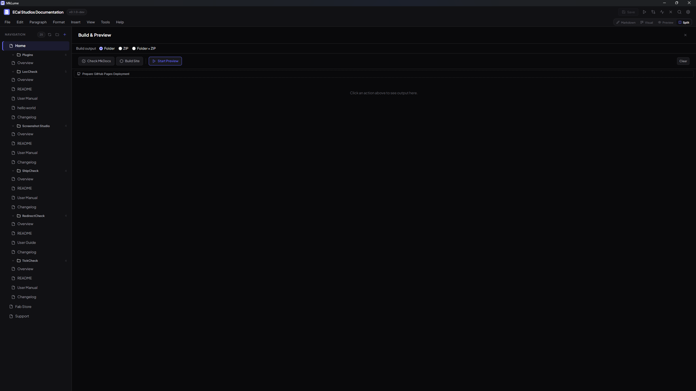

# Build & Export

MkLume builds your documentation project into a static website you can host anywhere. The build process uses MkDocs under the hood, converting your Markdown files and `mkdocs.yml` configuration into a fully functional HTML site.

## Prerequisites

Before building, you need MkDocs and Material for MkDocs installed on your system. MkLume provides a built-in check to verify your installation.

!!! tip "Check your MkDocs installation"
    Use the **MkDocs Check** feature in the Build panel to confirm that MkDocs and the Material theme are installed and accessible. If the check fails, install them with `pip install mkdocs-material` in your terminal.

## Build Options

The Build panel offers three options:

### Build to Folder

Generates your site into a `site/` directory inside your project folder. This is the standard MkDocs output and contains everything needed to serve your documentation.

### Build to ZIP

Creates a compressed `.zip` archive of your built site in the `dist/` directory. This is convenient when you need to hand off the site to someone else or upload it to a hosting provider.

### Build Both

Runs both builds at once, giving you the `site/` folder for local testing and a ZIP in `dist/` for distribution.

## Output Directories

| Directory | Contents |
|-----------|----------|
| `site/` | The built static site (HTML, CSS, JavaScript, images) |
| `dist/` | ZIP archive of the built site |

!!! info "Source vs. Built Site"
    Your **source project** is the `docs/` folder with your Markdown files and the `mkdocs.yml` configuration. The **built site** in `site/` is the generated output. You edit the source; you deploy the built site. These are two separate things, and only the source files should go into version control.

## What the Built Site Contains

The `site/` directory is a complete static website:

- HTML pages generated from your Markdown files
- CSS stylesheets (including the Material theme)
- JavaScript for search, navigation, and interactive features
- Any images or assets you included in your `docs/` folder
- A search index for client-side search

This is a self-contained static site. No server-side processing is required to host it.

## Build Output Log

The Build panel displays a live output log while the build runs. This shows the same output you would see running `mkdocs build` in a terminal, including any warnings about broken links, missing files, or configuration issues.

## Deploying Your Site

MkLume builds your site locally. It does not need access to any hosting account or service. You take the generated files and upload them yourself.

### General Steps

1. Build your site using any of the three build options
2. Upload the contents of `site/` (or extract the ZIP) to your hosting provider
3. Your documentation is live

### Hosting Providers

You can host MkDocs Material sites on any static hosting service. A few common options:

- **Netlify** -- Drag and drop the `site/` folder or ZIP into the Netlify dashboard
- **Cloudflare Pages** -- Upload the built output through the Cloudflare dashboard
- **GitHub Pages** -- Use the GitHub Pages Deploy Assistant in MkLume (see the dedicated guide)
- **Shared hosting** -- Upload the `site/` contents via FTP or your hosting control panel
- **Any static host** -- If it serves HTML files, it works

!!! note "No account access needed"
    MkLume never asks for hosting credentials, API keys, or account access. You build locally and upload the result however you prefer. Your credentials stay with you.

## Troubleshooting

**Build fails immediately** -- Run MkDocs Check to verify your installation. Make sure `mkdocs` and `mkdocs-material` are installed and accessible from the command line.

**Build warns about missing pages** -- Check that all pages referenced in your `mkdocs.yml` navigation exist in the `docs/` folder.

**Build output looks wrong** -- Make sure your `mkdocs.yml` specifies `theme: material` and that Material for MkDocs is installed.
