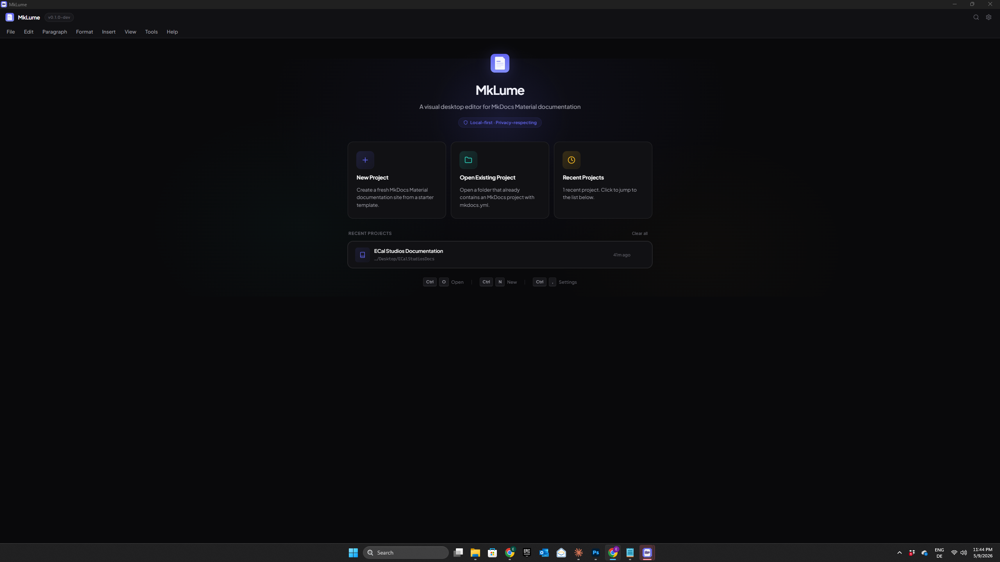

# Getting Started

This guide walks you through using MkLume for the first time — from opening a project to previewing and building your documentation.

## What is MkLume?

MkLume is a desktop application for creating and editing documentation sites built with [MkDocs Material](https://squidfunk.github.io/mkdocs-material/). It gives you a visual workspace so you can focus on writing instead of wrestling with tooling.

MkLume is designed for:

- **Technical writers** who want a clean editor for MkDocs projects
- **Developers** who want to maintain docs without context-switching to a terminal
- **Beginners** who are new to MkDocs and want a friendlier starting point
- **Anyone** who works with MkDocs Material and prefers a visual workflow

## What you need

MkLume itself has no hard dependencies for editing. You can open a project and start writing immediately.

However, some features require additional tools:

| Feature | Requires |
|---|---|
| Editing, visual mode, settings | Nothing extra |
| Local site preview (live server) | Python + MkDocs Material |
| Building / exporting your site | Python + MkDocs Material |
| Git Sync | Git |
| GitHub Pages deploy | Git + a GitHub repository |

!!! tip "Don't have Python or MkDocs?"
    You can still use MkLume to edit your Markdown files and manage your project structure. Install Python and MkDocs Material later when you're ready to build or preview locally.

## Quick walkthrough

### 1. Create or open a project

When you launch MkLume, you'll see the Welcome Screen. From here you can:

- **Create a new project** — MkLume generates a starter `mkdocs.yml` and `docs/index.md` for you. See [Your First Project](first-project.md) for details.
- **Open an existing project** — Point MkLume at a folder that already contains a `mkdocs.yml`. See [Open Existing Project](open-existing-project.md).

### 2. Edit a page

Once your project is open, select a page from the sidebar to start editing. MkLume offers two editing modes:

=== "Visual Mode"

    The visual editor lets you write and format content using toolbar controls. You can add headings, bold/italic text, lists, links, images, admonitions, and more — all without writing Markdown syntax.

    This is a good starting point if you're new to Markdown or prefer a WYSIWYG experience.

=== "Markdown Mode"

    The Markdown editor gives you direct access to the raw Markdown source with syntax highlighting. Use this when you need precise control over formatting or want to use advanced MkDocs Material features.

You can switch between modes at any time. Your content is preserved when switching.

### 3. Preview your page

MkLume shows a rendered preview of the current page. You can view the preview in a side-by-side split, or switch to a full preview layout.

!!! note
    The in-app preview gives you a good approximation of how your page will look. For an exact match, use the local MkDocs development server (requires Python and MkDocs Material installed).

### 4. Build your site

When you're ready to generate the final HTML site:

1. Open the **Build** panel
2. Click **Build Site**
3. MkLume runs `mkdocs build` and outputs your site to the `site/` folder

!!! warning "Requires Python and MkDocs"
    Building requires Python and MkDocs Material installed on your system. MkLume calls `mkdocs build` under the hood — if it's not available, the build will fail.

### 5. Publish

MkLume does not host your site for you. Once you've built your site, you can deploy it anywhere that serves static files:

- **GitHub Pages** — MkLume can generate a GitHub Actions workflow file for you
- **Netlify, Vercel, Cloudflare Pages** — Upload or connect your repository
- **Any web server** — Copy the contents of `site/` to your server

## Next steps

- [Installation](installation.md) — Install MkLume on your system
- [Your First Project](first-project.md) — Create a new documentation project from scratch
- [Open Existing Project](open-existing-project.md) — Open a project you already have
