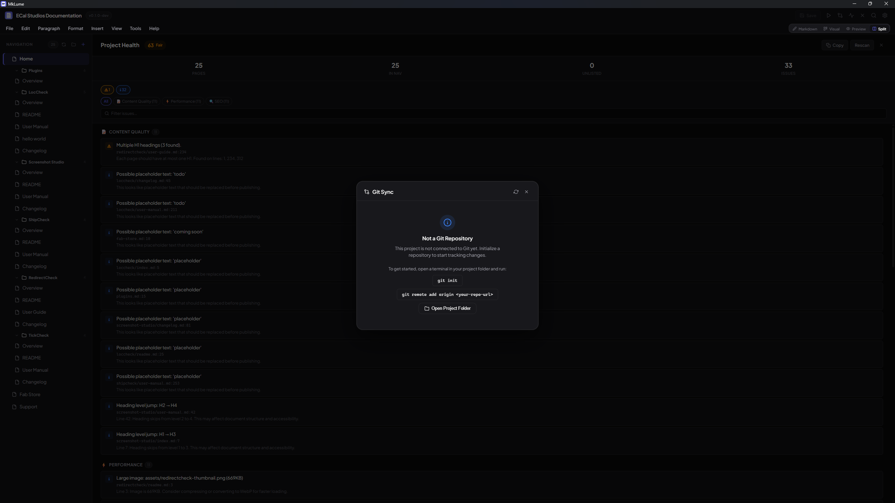

# Git Sync

Git Sync lets you commit and push your documentation changes directly from MkLume. It provides a straightforward way to save your work to a remote Git repository without switching to a terminal.

## What Git Sync Does

Git Sync performs two operations:

1. **Commits** all changed files in your project with a message you provide
2. **Pushes** the commit to your remote repository

That is all it does. It is intentionally simple.

## How It Works

### Repository Detection

When you open a project, MkLume checks whether the project folder is a Git repository. If it detects a `.git` directory, Git Sync becomes available in the interface.

### Changed Files

Git Sync shows you which files have been modified, added, or deleted since your last commit. This gives you a quick overview of what will be included in the commit.

### Committing and Pushing

1. Review the list of changed files
2. Write a commit message describing your changes
3. Click to commit and push

Git Sync stages all tracked changes, creates a commit with your message, and pushes to the remote.

## What Gets Staged

Git Sync stages all tracked changes in your project. This includes modified files, new files that Git is tracking, and deleted files. It behaves like running `git add` on all changed tracked files followed by `git commit` and `git push`.

## Safety Guarantees

Git Sync is designed to be safe. It will **never** perform any of these operations:

- **No force push** -- Your remote history is always respected
- **No reset** -- Your local changes are never discarded
- **No clean** -- Untracked files are never deleted
- **No merge** -- Merge operations are left to you
- **No rebase** -- Your commit history is never rewritten

If a push cannot be completed cleanly (for example, because the remote has new commits), Git Sync will stop and let you know. You handle the resolution yourself using your preferred Git tools.

## Authentication

MkLume does not store or manage Git credentials. Authentication is handled entirely by your local Git environment.

Common setups include:

- **SSH keys** -- If you have SSH keys configured for your Git host, Git Sync uses them automatically
- **Credential managers** -- Git Credential Manager, macOS Keychain, or Windows Credential Manager
- **Personal access tokens** -- Stored in your system's credential manager

!!! info "Your credentials stay local"
    MkLume never asks for your Git password, token, or SSH passphrase. It relies on whatever authentication your system's Git installation already has configured. MkLume does not store credentials of any kind.

## Requirements

Git must be installed on your system and accessible from the command line. MkLume calls Git directly, so if `git` works in your terminal, it works in MkLume.

## Troubleshooting

**Git not found** -- Make sure Git is installed and available on your system PATH. You can verify by running `git --version` in a terminal.

**Push rejected** -- This usually means the remote repository has commits that you do not have locally. Pull the latest changes using your terminal (`git pull`) and then try Git Sync again.

**Authentication failed** -- Your Git credentials may have expired or are not configured. Check your SSH keys or credential manager. Try running `git push` from a terminal to diagnose the issue.

**Merge conflicts** -- Git Sync does not resolve merge conflicts. If your push is rejected due to conflicts, use your terminal or a Git client to pull, resolve conflicts, and push manually.

!!! warning "Handle conflicts outside MkLume"
    Git Sync is designed for the common case: commit your changes and push them. For complex Git operations like merging, rebasing, or resolving conflicts, use a dedicated Git client or the command line.
