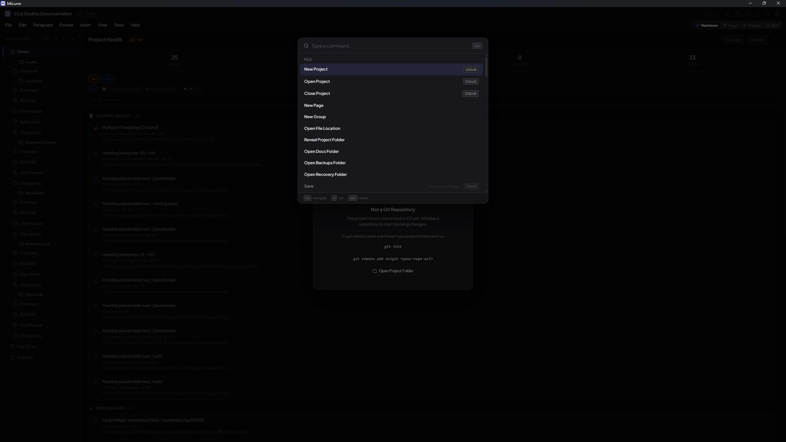

# Keyboard Shortcuts

MkLume supports keyboard shortcuts for common actions so you can work without reaching for the mouse. This page lists all available shortcuts.

## General

| Shortcut | Action |
|---|---|
| `Ctrl+S` | Save the current page |
| `Ctrl+O` | Open a project |
| `Ctrl+N` | Create a new page or project |
| `Ctrl+W` | Close the current page |

## View modes

| Shortcut | Action |
|---|---|
| `Ctrl+1` | Switch to Markdown mode |
| `Ctrl+2` | Switch to Visual mode |
| `Ctrl+3` | Switch to Preview mode |
| `Ctrl+4` | Switch to Split mode |

## Command palette

| Shortcut | Action |
|---|---|
| `Ctrl+K` | Open the command palette |
| `Ctrl+Shift+P` | Open the command palette (alternate) |

The command palette gives you quick access to most MkLume actions. Start typing to filter commands.

## Text formatting

These shortcuts work in the Markdown editor:

| Shortcut | Action |
|---|---|
| `Ctrl+B` | Bold |
| `Ctrl+I` | Italic |
| `Ctrl+E` | Inline code |
| `Ctrl+Shift+K` | Code block |

## Find and replace

| Shortcut | Action |
|---|---|
| `Ctrl+F` | Open find |
| `Ctrl+H` | Open find and replace |

## Editing

| Shortcut | Action |
|---|---|
| `Ctrl+Shift+V` | Paste as plain text |
| `Tab` | Indent the current line or selection |
| `Shift+Tab` | Unindent the current line or selection |

## Navigation

| Shortcut | Action |
|---|---|
| `Escape` | Close the current overlay, dialog, or panel |

!!! tip
    The command palette (`Ctrl+K`) is the fastest way to discover and run actions you don't have a shortcut memorized for. It searches across all available commands.
