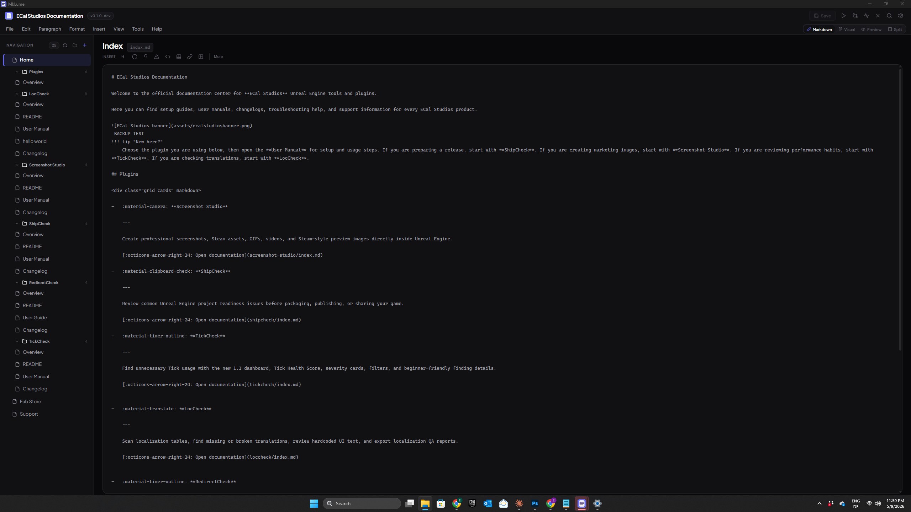

# Markdown Mode

Markdown Mode is a raw text editor for writing Markdown directly. It gives you full control over your content, with tooling to help you insert common elements and navigate your document quickly.

---

## The Editor

The main editing area is a plain textarea where you type Markdown. What you see is the raw source — headings are lines starting with `#`, bold text is wrapped in `**`, and so on.

A status bar at the bottom of the editor shows the current **line count**, **word count**, and **character count** for the file you're editing.

---

## Insert Toolbar

Above the editor, a toolbar provides quick-insert buttons for common Markdown elements:

- **Headings** (H1 through H6)
- **Bold**, **Italic**, **Strikethrough**
- **Inline code** and **Code blocks**
- **Bullet lists**, **Numbered lists**, **Task lists**
- **Blockquotes**
- **Tables**
- **Admonitions**
- **Links** and **Images**
- **Horizontal dividers**
- **Buttons** (MkDocs Material style)

Clicking a toolbar button inserts the appropriate Markdown syntax at your cursor position. For elements that wrap selected text (like bold or italic), selecting text first and then clicking the button will wrap the selection.

---

## Keyboard Shortcuts

Common formatting operations have keyboard shortcuts so you can stay in the flow of writing:

| Shortcut | Action |
|---|---|
| ++ctrl+b++ | **Bold** — wraps selection in `**` |
| ++ctrl+i++ | **Italic** — wraps selection in `*` |
| ++ctrl+e++ | **Inline code** — wraps selection in backticks |
| ++ctrl+shift+k++ | **Code block** — inserts a fenced code block |
| ++tab++ | **Indent** — adds indentation to the current line or selection |
| ++ctrl+f++ | **Find** — opens the Find bar |
| ++ctrl+h++ | **Find and Replace** — opens Find and Replace |

---

## Insert Menu

The Insert menu gives you access to MkDocs Material-specific components and more complex Markdown structures. It includes:

- **Admonition** — inserts a Material admonition block (`!!! note`, `!!! warning`, etc.) with a type selector
- **Details** (collapsible admonition) — inserts a `??? note` block that readers can expand and collapse
- **Content Tabs** — inserts a `=== "Tab 1"` tabbed content block
- **Grid Cards** — inserts a Material grid card layout
- **Table** — inserts a Markdown table with a configurable number of rows and columns
- **Button** — inserts a Material-style button link
- **Link** — inserts a standard Markdown link
- **Internal Link** — inserts a link to another page in your project (with autocomplete)
- **Image** — inserts an image reference
- **Footnote** — inserts a footnote marker and definition
- **Front Matter** — inserts or edits YAML front matter at the top of the file
- **Divider** — inserts a horizontal rule (`---`)

---

## Smart Internal Links

When you're linking to other pages in your documentation project, MkLume helps you find the right path.

Typing `[[` in the editor triggers an autocomplete dropdown showing all pages in your project. Select a page from the list and MkLume inserts a properly formatted Markdown link with the correct relative path.

The same autocomplete also activates when you type a standard Markdown link pattern like `[Link Text](` — MkLume will offer matching pages from your project as you type inside the parentheses.

This saves you from having to remember or look up file paths manually, and helps keep your internal links accurate.

---

## Drag-and-Drop Images

You can drag image files from your file manager directly into the Markdown editor. When you drop an image:

1. MkLume copies the image file into your project's `docs/assets` folder (creating it if needed)
2. A Markdown image reference is inserted at the drop position, pointing to the copied file

This is the fastest way to add images to your documentation. The image is stored locally inside your project, so it works with `mkdocs build` and version control without any extra setup.

---

## Find and Replace

Press ++ctrl+f++ to open the **Find** bar, or ++ctrl+h++ to open **Find and Replace**.

- **Find** highlights all occurrences of the search term in the document and lets you step through them one at a time.
- **Replace** lets you replace the current match or all matches at once.

The Find bar appears at the top of the editor area. Press ++escape++ to close it.

---

## Tips

!!! tip "Use the Insert menu for Material components"
    If you're not sure of the exact syntax for an admonition, content tabs, or grid cards, use the Insert menu. It generates the correct Markdown structure so you don't have to look it up.

!!! tip "Combine with Split View"
    Markdown Mode works well in Split View — write on the left and see the rendered result on the right, updating live as you type. Press ++ctrl+4++ to enter Split View.
