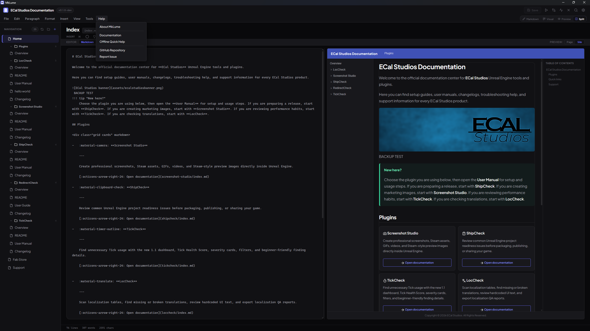

# Offline Quick Help

MkLume includes a built-in quick help reference that works without an internet connection. You can access it from the **Help** menu at any time.

## What It Covers

The offline quick help provides a concise reference for the most common tasks in MkLume:

### Creating and Opening Projects

- How to create a new MkDocs Material project
- How to open an existing project folder
- What MkLume looks for when opening a project (mkdocs.yml)

### Editing

- Switching between Visual and Markdown editing modes
- Basic formatting and Markdown syntax
- Using the toolbar for common formatting actions
- Working with the file sidebar

### Preview

- How to preview your documentation as you write
- Live preview updates

### Building

- Building your site to a folder or ZIP
- Where the output goes
- What to do with the built files

### Git Sync

- Committing and pushing changes
- What Git Sync does and does not do
- Basic Git requirements

## Full Documentation

The offline quick help is a condensed reference. For detailed guides, tutorials, and in-depth coverage of all features, visit the full MkLume documentation:

**[https://www.ecalstudios.com/mklume/](https://www.ecalstudios.com/mklume/)**

!!! tip "Bookmark the full docs"
    The offline quick help is designed for quick reminders while you work. If you are learning MkLume for the first time or need detailed explanations, the online documentation at [ecalstudios.com/mklume](https://www.ecalstudios.com/mklume/) covers everything in depth.

## Why Offline?

MkLume is a local-first application. The quick help is bundled with the app so you always have access to basic guidance, even without an internet connection. No data is fetched from external servers when you open the help panel.
