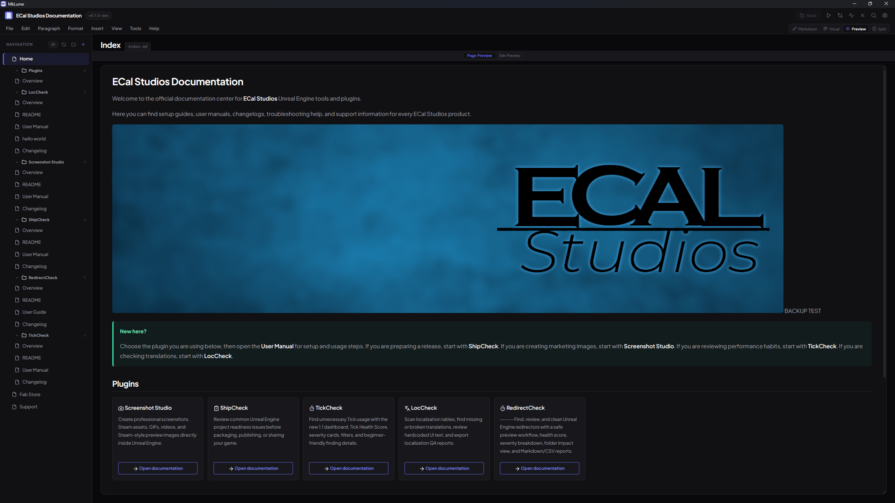
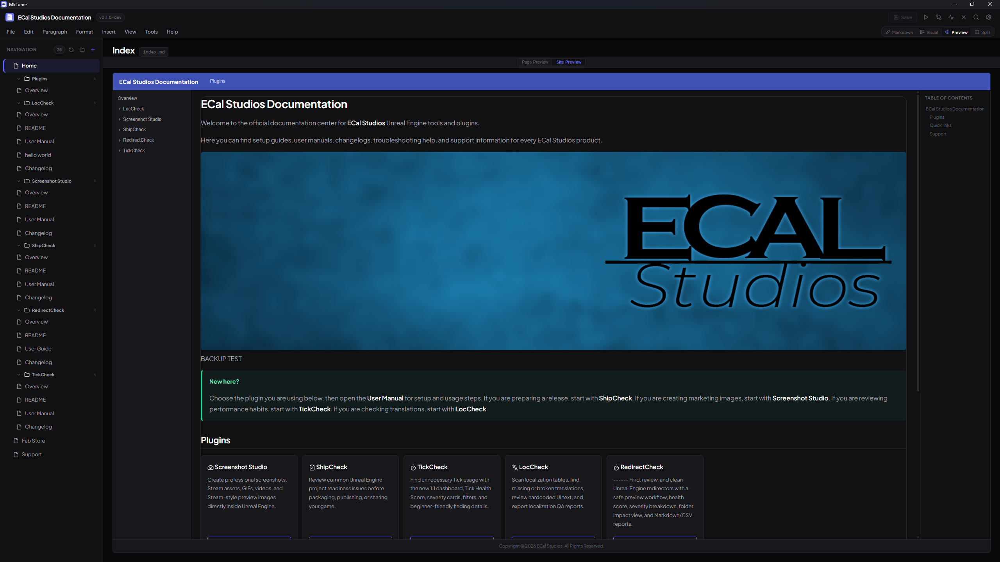

# Preview and Site Preview

MkLume includes two preview modes that let you see how your content will look without leaving the editor. **Page Preview** renders the current page's Markdown, and **Site Preview** wraps it in an approximate MkDocs Material site layout.

---

## Page Preview

Page Preview renders the current Markdown file as formatted HTML. You'll see your content with:

- Headings, paragraphs, and inline formatting
- Images (loaded from your project's docs folder)
- Admonitions (note, tip, warning, danger, etc.) styled like MkDocs Material
- Tables with proper formatting
- Code blocks with syntax highlighting
- Task lists with checkboxes
- Content tabs, grid cards, buttons, and other Material components

This gives you a quick sense of how the page content will look on the published site, without the surrounding navigation chrome.

Page Preview is read-only — you can't edit content here, but you can scroll through and check that everything renders as expected.

---

## Site Preview

Site Preview goes a step further and renders the page inside an approximate MkDocs Material site layout. This includes:

- **Header bar** — displays the `site_name` from your `mkdocs.yml`, styled with the configured `primary` color
- **Left sidebar** — shows the navigation tree from your `mkdocs.yml` `nav` section
- **Main content area** — the rendered page content (same as Page Preview)
- **Right sidebar (TOC)** — a table of contents extracted from the headings on the current page
- **Footer** — displays the `copyright` text from your `mkdocs.yml`

### Navigation

If your `mkdocs.yml` uses `navigation.tabs`, the Site Preview renders the top-level navigation items as tabs in the header bar, matching the Material theme's tab-based navigation layout.

Clicking an item in the left sidebar navigates to that page in the editor. This lets you browse through your documentation structure without leaving MkLume.

### "Not in nav" Warning

If the page you're viewing isn't listed in the `nav` section of your `mkdocs.yml`, Site Preview shows a warning banner. This is a heads-up that the page exists in your `docs` folder but won't appear in the site's navigation unless you add it to your `mkdocs.yml`.

---

## Switching Between Previews

When you're in Preview mode, a toggle in the controls bar lets you switch between **Page Preview** and **Site Preview**. Both update to reflect the current state of your file.

In Split View, the same toggle appears in the split controls bar, so you can choose which preview type appears on the right side.

---

## What the Preview Shows (and Doesn't)

MkLume's preview is an approximation of how your site will look. It covers the most commonly used MkDocs Material features and gives you a reliable sense of your content's structure and formatting.

However, the preview is **not** a full MkDocs build. Some differences to be aware of:

!!! info "Preview vs. real MkDocs output"

    - **Search** is not functional in the preview — it's a static rendering.
    - **Custom CSS/JS** defined in your `mkdocs.yml` `extra_css` or `extra_js` is not loaded in the preview.
    - **Third-party plugins** that transform content at build time won't be reflected.
    - **Some theme features** (like announcement bars, versioning dropdowns, or social cards) are not rendered.
    - **Cross-page links** are resolved within MkLume's editor, not via MkDocs's link resolution.

For an exact representation of your final site, run `mkdocs serve` from the Build panel and open the result in your browser. MkLume's "Open in Browser" option in the Build panel makes this easy — it starts the local dev server and opens the site in your default browser.

!!! tip "Use Site Preview for structure, the browser for pixel-perfect accuracy"
    Site Preview is great for checking navigation, page layout, and content structure as you work. When you need to verify exact styling, plugin behavior, or cross-page interactions, use `mkdocs serve` for the real thing.
