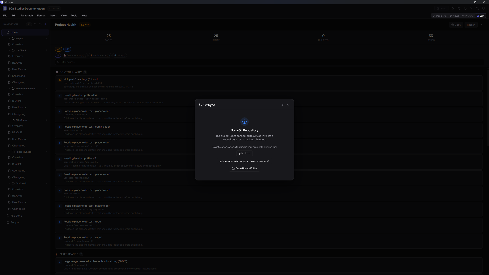

# Project Health

MkLume includes a health scanner that checks your documentation project for common problems — broken links, missing images, navigation issues, and more. It helps you catch mistakes before you build or publish.

## Opening the health panel

The Project Health panel is accessible from the sidebar. Open it to run a scan or review previous results.

## What gets checked

The health scanner looks for issues across several categories:

### Broken internal links

Finds links in your Markdown files that point to pages or anchors that don't exist. This catches typos in file paths and references to pages that have been renamed or deleted.

### Missing images

Detects image references that point to files not found in your project. This can happen when an image is deleted, moved, or when the path is typed incorrectly.

### Navigation issues

- **Missing pages** — Pages listed in the `nav` section of `mkdocs.yml` that don't exist on disk
- **Unlisted pages** — Markdown files in your `docs/` folder that aren't included in the navigation

### mkdocs.yml issues

Checks for problems in your project configuration file, such as invalid values or missing required fields.

### Material extension checks

Verifies that Markdown extensions referenced in your configuration are consistent and properly set up for MkDocs Material.

### SEO and content checks

- **Missing titles** — Pages that don't have a top-level heading (`# Title`)
- **Empty pages** — Markdown files with no meaningful content

### Asset size checks

Flags unusually large files in your assets folder that could slow down your site's load time.

### Icon shortcode checks

Detects icon shortcodes (e.g., `:material-home:`) that reference icons not available in the configured icon sets.

## Scan results

After running a scan, MkLume shows a summary with counts for each severity level:

| Level | Meaning |
|---|---|
| **Errors** | Problems that will likely cause build failures or broken pages |
| **Warnings** | Issues that won't break your build but should be addressed |
| **Info** | Suggestions and minor improvements |

Each issue includes a description and, where applicable, the file and line number involved.

## One-click fixes

Some issues can be resolved directly from the health panel:

- **Add to nav** — For unlisted pages, click to add the page to your `mkdocs.yml` navigation
- **Remove from nav** — For missing page entries, click to remove the broken reference from the navigation

These fixes are safe — they only modify the `nav` section of your `mkdocs.yml` and don't create or delete any files.

!!! tip
    Not all issues have automatic fixes. For broken links or missing images, you'll need to correct the paths manually in the editor.

## Rescanning

Click the **Rescan** button to run the health check again. This is useful after you've made fixes and want to verify that the issues are resolved.

!!! info
    The health scan reads your project files from disk. If you have unsaved changes in the editor, save first to make sure the scan reflects your latest edits.
