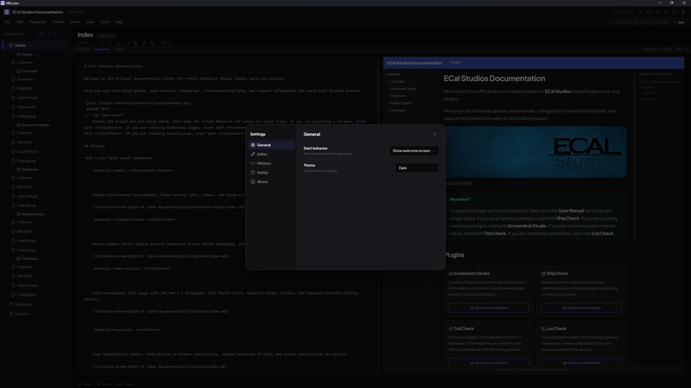

# App Settings

MkLume's application settings control how the editor behaves. These are separate from your project's [Site Settings](site-settings.md), which configure your `mkdocs.yml`.

Open the settings panel from the menu or by searching for "Settings" in the command palette.

## Startup

### Start behavior

Choose what happens when you launch MkLume:

- **Welcome screen** — Show the welcome screen with recent projects and options to create or open a project
- **Reopen last project** — Automatically reopen the project you were working on when you last closed MkLume

## Appearance

### Theme

Set the application theme:

- **Dark** — Dark background with light text
- **Light** — Light background with dark text
- **System** — Follow your operating system's theme setting

### Editor font size

Adjust the font size used in the Markdown editor. This affects both the Markdown and Visual editing modes.

### Word wrap

Toggle whether long lines wrap in the editor or extend beyond the visible area with horizontal scrolling.

## Saving

### Autosave

When enabled, MkLume automatically saves your changes after a period of inactivity. You can adjust the delay — a shorter delay saves more frequently, while a longer delay gives you more time before a save is triggered.

!!! tip
    Even with autosave enabled, you can still save manually at any time with `Ctrl+S`. Autosave is a safety net, not a replacement for intentional saves.

### Backup before save

When enabled, MkLume creates a backup copy of the file before overwriting it with new changes. This gives you a recovery point if something goes wrong during a save.

### Recovery drafts

MkLume can keep recovery drafts of your unsaved work. If the application closes unexpectedly — a crash, power outage, or accidental close — your unsaved changes can be recovered when you reopen the project.

## Tools

### Python command

The command MkLume uses to run Python (e.g., `python`, `python3`, or a full path to a Python executable). This is used when building your site or running the local preview server.

### MkDocs command

The command MkLume uses to run MkDocs (e.g., `mkdocs` or a full path). Override this if MkDocs is installed in a non-standard location or if you use a wrapper script.

!!! note
    If MkLume can't find Python or MkDocs, build and preview features won't work. You can still edit your project — these tools are only needed for building and previewing.

## Warning dialogs

MkLume shows confirmation dialogs before certain destructive or important actions. You can enable or disable these individually:

| Dialog | When it appears |
|---|---|
| Delete confirmation | Before deleting a page from your project |
| Remove recent | Before removing a project from the recent projects list |
| Overwrite warning | Before overwriting a file that has been modified outside MkLume |
| Page switch warning | Before switching pages when you have unsaved changes |

!!! warning
    Disabling these dialogs means the action will happen immediately without asking for confirmation. Only disable them if you're confident you won't need the safety check.
