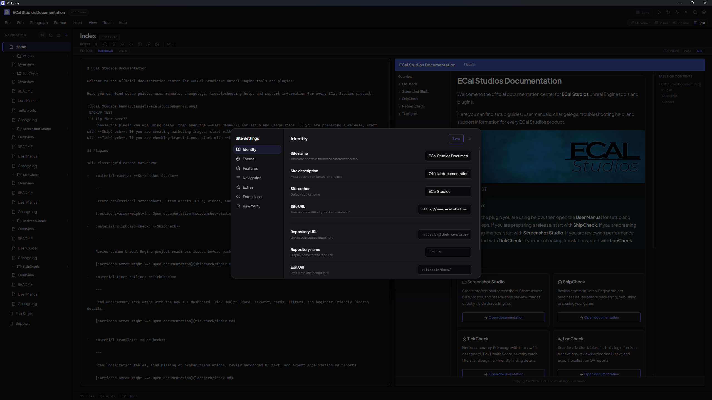

# Site Settings

MkLume provides a visual editor for your project's `mkdocs.yml` configuration. Instead of editing YAML by hand, you can configure your site's identity, theme, and features through a settings panel.

Open the Site Settings panel from the sidebar or through the command palette.

## Identity

These fields control the basic metadata for your documentation site.

| Setting | YAML key | Description |
|---|---|---|
| Site name | `site_name` | The title shown in the browser tab and site header |
| Site description | `site_description` | A short description used in search engine metadata |
| Site author | `site_author` | The author name included in page metadata |
| Site URL | `site_url` | The full URL where your site will be published |

## Repository

Link your documentation to its source code repository.

| Setting | YAML key | Description |
|---|---|---|
| Repository URL | `repo_url` | URL of the source repository (e.g., GitHub link) |
| Repository name | `repo_name` | Display name shown next to the repo link |
| Edit URI | `edit_uri` | Path template for "edit this page" links |

## Copyright

Set a copyright notice that appears in the site footer.

## Theme settings

### Logo and favicon

Set a custom logo and favicon for your site. These accept a path relative to your `docs/` folder (e.g., `assets/logo.png`).

### Language

Set the language code for your site (e.g., `en`, `es`, `fr`). This affects the MkDocs Material interface language.

### Material features

MkLume gives you toggles for the most commonly used MkDocs Material theme features:

| Feature | What it does |
|---|---|
| `navigation.tabs` | Shows top-level sections as tabs in the header |
| `navigation.sections` | Renders sections as groups in the sidebar |
| `navigation.top` | Adds a "back to top" button |
| `navigation.footer` | Shows previous/next page links in the footer |
| `navigation.instant` | Enables instant loading (SPA-like navigation) |
| `navigation.tracking` | Updates the URL hash as you scroll through sections |
| `navigation.indexes` | Allows section index pages |
| `navigation.expand` | Expands all sidebar sections by default |
| `navigation.path` | Shows a breadcrumb path above the page title |
| `header.autohide` | Hides the header when scrolling down |
| `toc.follow` | Highlights the active heading in the table of contents |
| `toc.integrate` | Integrates the table of contents into the sidebar |
| `search.suggest` | Shows search suggestions as you type |
| `search.highlight` | Highlights search terms on the result page |
| `search.share` | Adds a share button to search results |
| `content.tabs.link` | Links content tabs with the same label across pages |
| `content.code.copy` | Adds a copy button to code blocks |
| `content.code.annotate` | Enables code annotations |

Toggle these on or off as needed. MkLume writes the corresponding entries into your `mkdocs.yml` automatically.

### Color palette

The palette editor lets you configure your site's color scheme:

- **Scheme** — `default` (light) or `slate` (dark)
- **Primary color** — The main brand color used for the header and links
- **Accent color** — The highlight color used for interactive elements

You can set up a light/dark toggle so visitors can switch between schemes. MkLume configures both palettes and the toggle icon for you.

## Raw YAML view

If you need to see or edit the underlying YAML directly, the raw YAML view shows the full contents of your `mkdocs.yml`. This is useful for advanced configurations or for verifying what MkLume has written.

!!! warning "Complex configurations"
    MkLume's visual settings editor covers the most common MkDocs Material options. If your project uses advanced or custom configuration — such as custom plugins with complex options, multi-file includes, or YAML anchors — you may want to review the raw YAML view to make sure everything looks right.

## Preserving custom configuration

MkLume only modifies the YAML keys it manages. Any keys it doesn't recognize — custom plugin settings, third-party extensions, or other configuration — are preserved as-is when MkLume saves the file. Your custom configuration won't be removed or overwritten.

!!! tip
    If you've manually edited your `mkdocs.yml` outside of MkLume, your changes will be preserved the next time MkLume writes to the file, as long as they don't conflict with settings MkLume manages.
