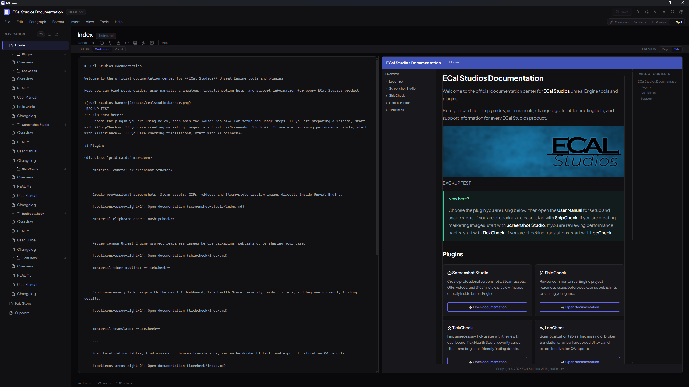

# Split View

Split View places an editor and a preview side by side, so you can write content on the left and see the rendered result on the right. The preview updates live as you type.

Press ++ctrl+4++ to enter Split View, or select it from the view controls in the top bar.

---

## The Four Combinations

Split View pairs one of the two editor modes with one of the two preview types. That gives you four possible layouts:

=== "Markdown + Page Preview"

    Raw Markdown editing on the left, rendered page content on the right. This is the most common split layout — you write Markdown and immediately see how it renders.

    Best for: general writing, checking formatting as you go.

=== "Markdown + Site Preview"

    Raw Markdown editing on the left, full site layout preview on the right. You see the page content wrapped in the MkDocs Material navigation, header, and footer.

    Best for: checking how your page fits into the overall site structure.

=== "Visual + Page Preview"

    Block-based visual editing on the left, rendered page content on the right. Useful if you prefer the visual editor but still want to see the final rendered output alongside it.

    Best for: visual editing with a rendered reference.

=== "Visual + Site Preview"

    Block-based visual editing on the left, full site layout preview on the right. The most "WYSIWYG-like" combination — visual blocks on one side, the approximate published result on the other.

    Best for: structuring content while keeping an eye on site-level layout.

---

## Split Controls Bar

When Split View is active, a controls bar appears between the two panes. It contains two toggles:

- **Editor toggle** — switches the left pane between **Markdown** and **Visual** mode
- **Preview toggle** — switches the right pane between **Page Preview** and **Site Preview**

You can change either toggle at any time without losing your work. The content stays in sync across all modes.

---

## Live Preview Updates

The preview pane updates automatically as you edit. There's no "refresh" button — changes appear in the preview as you type them.

For large or complex pages, there may be a brief delay between typing and the preview updating, but for most documents the feedback is effectively instant.

---

## When to Use Split View

Split View is particularly useful when:

- You're writing content and want to verify formatting without switching modes
- You're working with Material-specific components (admonitions, tabs, grid cards) and want to see how they render
- You're checking that your page looks right within the site's navigation layout
- You're editing a page for the first time and want a side-by-side reference

!!! tip
    If you find the split layout too cramped on a smaller screen, you can always switch back to a full-width editor or preview. Split View works best when you have enough horizontal space for both panes to be comfortably readable.
