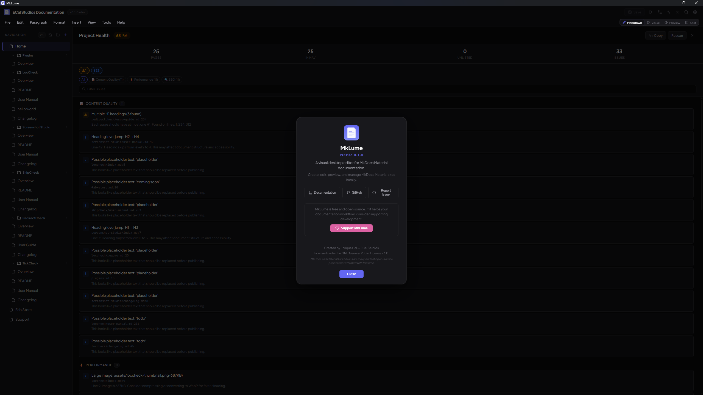

# Support

MkLume is free and open source. If it helps your documentation workflow, you can support development.

## Support on Ko-fi

If you find MkLume useful and want to help keep it going, consider a contribution:

[Support MkLume on Ko-fi](https://ko-fi.com/ecalstudios){ .md-button }

Every bit helps and is genuinely appreciated.

## Report a bug

Found something broken? [Open an issue on GitHub](https://github.com/ECalStudios/mklume/issues) with:

- A description of the problem
- Steps to reproduce it
- Your OS and MkLume version
- Screenshots or error messages, if available

See the [Contributing guide](contributing.md) for more details.

## Request a feature

Have an idea for something MkLume should do? Feature requests are welcome via [GitHub Issues](https://github.com/ECalStudios/mklume/issues). Check existing issues first to see if someone has already suggested it.

## Get help

For general questions, check the [FAQ](faq.md) and [Troubleshooting](troubleshooting.md) pages first. If those do not cover your situation, [open an issue on GitHub](https://github.com/ECalStudios/mklume/issues) and describe what you need help with.

## Thank you

Thank you to everyone who has contributed feedback, bug reports, ideas, and code. MkLume is better because of its community.
