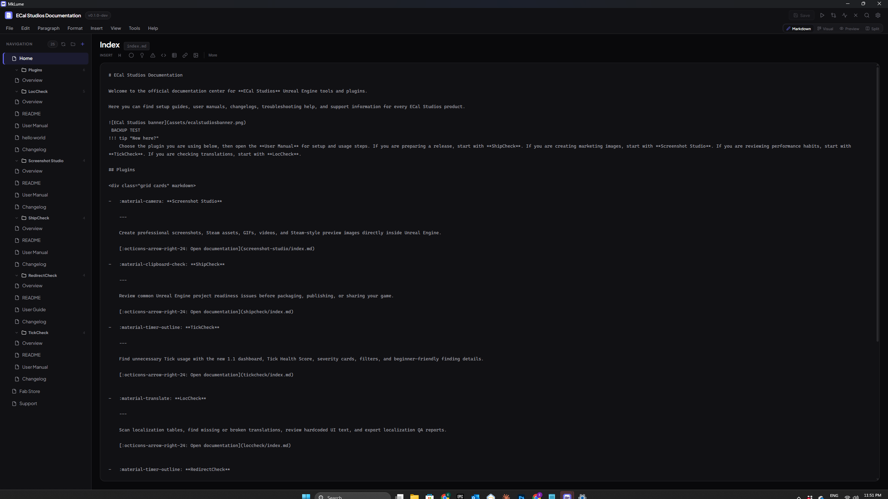

# Visual Editor

The Visual Editor presents your Markdown page as a series of editable blocks. Instead of writing raw syntax, you work with structured content blocks — headings, paragraphs, images, admonitions, and more — and edit them inline.

Your changes are automatically synced back to the underlying Markdown file. You can switch to Markdown Mode at any time to see (or edit) the raw source.

---

## How It Works

When you open a page in Visual Mode, MkLume parses the Markdown and converts it into a sequence of blocks. Each block represents a distinct content element — a heading, a paragraph, a code block, an admonition, and so on.

You edit blocks directly in place. Click on a heading to change its text. Click on a paragraph to type. Use the controls on each block to change its settings (like the admonition type or code language).

When you're done, MkLume converts the blocks back to Markdown and saves the file. The round-trip is designed to preserve your content faithfully, though very complex or unusual Markdown may be simplified in some cases.

---

## Block Types

The Visual Editor supports 18+ block types:

| Block Type | Description |
|---|---|
| **Heading** | H1 through H6 headings |
| **Paragraph** | Standard text content |
| **Image** | Inline images with alt text |
| **Admonition** | Material admonition boxes (note, tip, warning, etc.) |
| **Code Block** | Fenced code blocks with language selection |
| **Table** | Markdown tables with row/column editing |
| **Divider** | Horizontal rules |
| **Blockquote** | Quoted text blocks |
| **Bullet List** | Unordered lists |
| **Numbered List** | Ordered lists |
| **Task List** | Checkbox lists |
| **Definition List** | Term-definition pairs |
| **Grid Cards** | Material grid card layouts |
| **Content Tabs** | Tabbed content sections |
| **Button** | Material-style button links |
| **Front Matter** | YAML metadata at the top of the page |
| **Raw Markdown** | A fallback block for any Markdown the visual editor can't represent as a richer block type |

---

## Adding Blocks

To add a new block, click the **+** button that appears between existing blocks (or at the bottom of the page). This opens a block picker where you can choose the type of block to insert.

You can also just start typing in an empty area — MkLume will create a paragraph block automatically.

---

## Editing Blocks

Click on any block to edit it. Most blocks support inline editing — you type directly into the block content without opening a separate dialog.

Some blocks have additional controls:

- **Admonitions** have a type selector (note, tip, warning, danger, etc.) and a title field
- **Code blocks** have a language selector
- **Tables** have controls to add or remove rows and columns
- **Content tabs** let you add, remove, and rename tabs
- **Images** let you set alt text and adjust the source path

---

## Reordering Blocks

You can drag blocks to reorder them. Grab a block by its drag handle (visible when you hover over the block) and move it to a new position in the document.

This is especially handy for reorganizing sections of a page without cutting and pasting raw Markdown.

---

## Raw Markdown Blocks

When MkLume encounters Markdown that doesn't map neatly to one of the supported block types — for example, complex nested structures, HTML blocks, or unusual syntax — it wraps that content in a **Raw Markdown** block.

Raw Markdown blocks display the source text in a code-editor style area. You can edit the raw Markdown directly inside the block. The content is preserved exactly as written when the file is saved.

You can also insert a Raw Markdown block yourself if you want to write arbitrary Markdown that the visual editor doesn't have a dedicated block type for.

---

## Limitations

The Visual Editor handles most common Markdown and MkDocs Material syntax well, but there are some things to be aware of:

- **Complex nesting** — Deeply nested structures (like admonitions inside tabs inside grid cards) may appear as Raw Markdown blocks rather than fully rendered visual blocks.
- **Inline formatting precision** — While paragraphs support bold, italic, and other inline formatting, very complex inline markup may not round-trip perfectly in all cases.
- **Not all Material extensions** — Some less common MkDocs Material extensions or custom plugins may not have dedicated block types. Content using those features will appear as Raw Markdown blocks.

!!! tip "When in doubt, check the Markdown"
    If you're unsure whether the Visual Editor preserved your content exactly, switch to Markdown Mode and verify the raw source. You can always make corrections there.

---

## When to Use Visual Mode

Visual Mode works well for:

- Writing new content from scratch
- Making quick edits to existing pages
- Reorganizing page structure by dragging blocks
- Users who prefer a document-editor feel over raw Markdown

For complex layouts, heavy use of Material-specific syntax, or precise formatting control, Markdown Mode may be a better fit.
